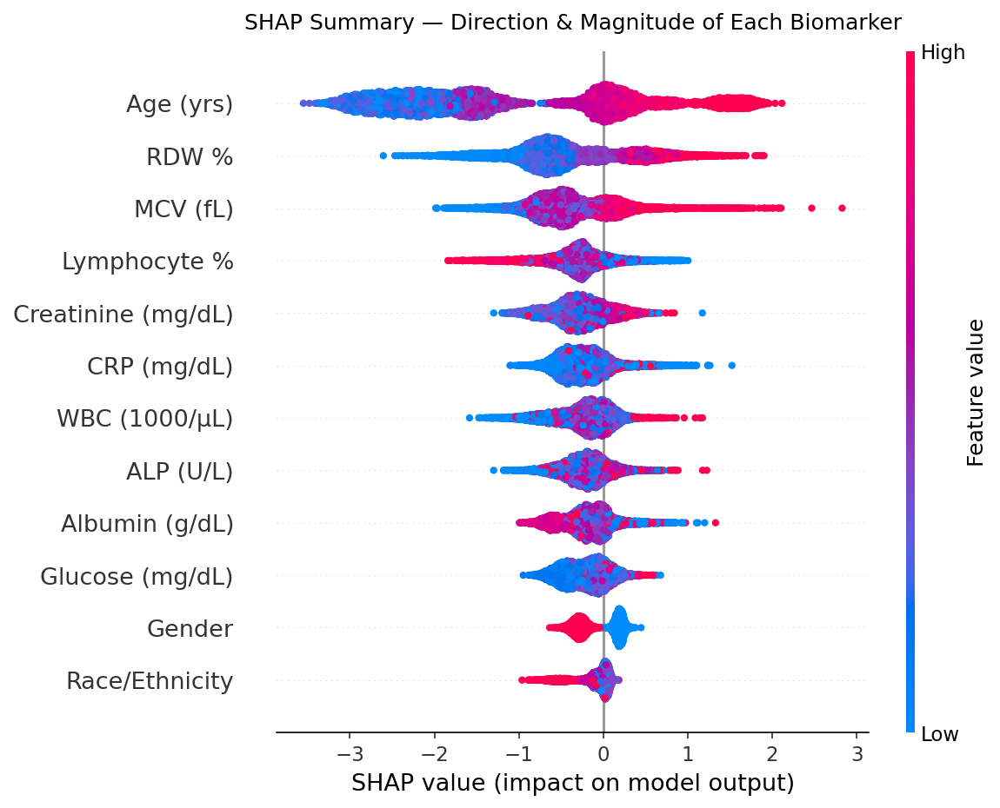
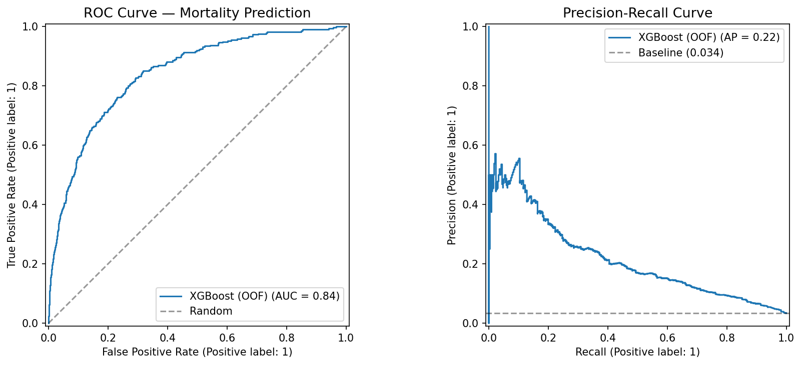
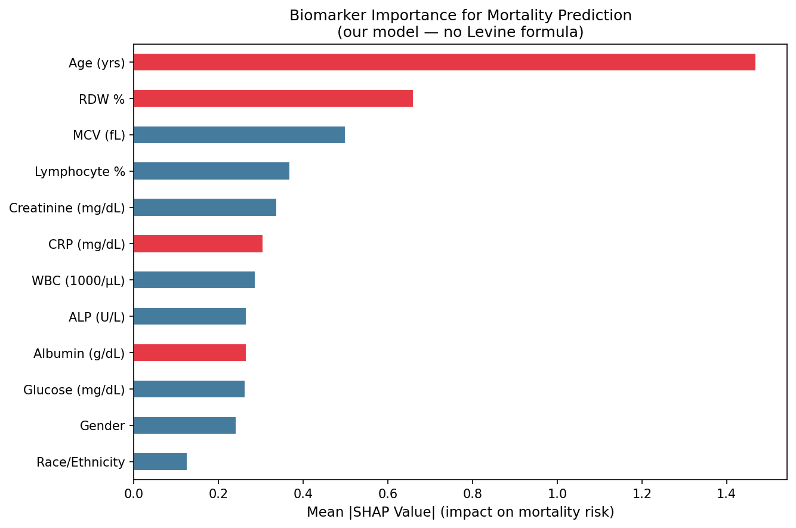

# NHANES Biological Age & Mortality Predictor

**Which blood biomarkers actually predict how long you live?**

This project answers that question directly — using real mortality data from 9,998 Americans tracked across 4 years, not a derived formula.

[](https://python.org)
[](https://www.cdc.gov/nchs/nhanes/)
[]()
[]()

---

## Key Findings

Model trained on 9 standard blood panel biomarkers + demographics to predict all-cause mortality. **AUC = 0.842 ± 0.008** across 5-fold cross-validation.

### Biomarker Importance Ranking (SHAP)

| Rank | Biomarker | SHAP Score | Direction |
|------|-----------|------------|-----------|
| 1 | Age | 1.469 | Higher → more risk |
| 2 | **RDW %** | 0.660 | Higher → more risk ⚠️ |
| 3 | MCV (fL) | 0.500 | Higher → more risk |
| 4 | Lymphocyte % | 0.369 | Lower → more risk |
| 5 | Creatinine (mg/dL) | 0.338 | Higher → more risk |
| 6 | CRP (mg/dL) | 0.305 | Higher → more risk |
| 7 | WBC (1000/µL) | 0.287 | Elevated → more risk |
| 8 | ALP (U/L) | 0.265 | Elevated → more risk |
| 9 | Albumin (g/dL) | 0.265 | Lower → more risk |
| 10 | Glucose (mg/dL) | 0.263 | Higher → more risk |

### The Headline Finding

**RDW (Red Cell Distribution Width) is the strongest modifiable biomarker predictor of mortality** — outranking CRP, albumin, and glucose. It is included in every standard CBC panel, costs nothing extra, and is almost universally ignored in longevity discussions dominated by inflammation markers.

High RDW reflects variability in red blood cell size — a signal of systemic stress, nutritional deficiency (B12, folate, iron), and impaired bone marrow function. It rises with age but also responds to lifestyle factors.

### Divergence from PhenoAge (Levine 2018)

The Levine PhenoAge formula weights RDW heavily (coefficient 0.3306 — the largest in the model). Our independent data-driven approach arrives at the **same conclusion through a completely different method** — validating RDW as a robust longevity signal across both formula-based and ML-based approaches.

CRP ranks 6th in our model despite dominating longevity discussions. It has real signal but loses independent predictive power once RDW, MCV, and lymphocyte % are accounted for.

---

## Project Structure

```
nhanes-biological-age/
├── data/
│   ├── raw/              # NHANES XPT files (downloaded separately)
│   │   ├── 2015_2016/
│   │   ├── 2017_2018/
│   │   ├── 2017_2020/
│   │   └── mortality/
│   └── processed/        # nhanes_merged.parquet (generated)
├── src/
│   ├── data_loader.py    # NHANES download script
│   ├── preprocessing.py  # Merge, clean, compute biological age
│   ├── model.py          # XGBoost mortality model + SHAP
│   └── inference.py      # Predict mortality risk from a blood panel
├── results/
│   ├── roc_pr_curves.png
│   ├── shap_importance.png
│   ├── shap_beeswarm.png
│   ├── feature_importance.csv
│   └── cv_summary.csv
├── requirements.txt
└── README.md
```

---

## Quickstart

### 1. Install dependencies
```bash
git clone https://github.com/YOUR_USERNAME/nhanes-biological-age
cd nhanes-biological-age
pip install -r requirements.txt
# Mac users (XGBoost): conda install -c conda-forge xgboost
```

### 2. Download NHANES data
CDC blocks automated downloads. Download manually from [wwwn.cdc.gov/nchs/nhanes](https://wwwn.cdc.gov/nchs/nhanes/):

**2015-2016:** DEMO_I.XPT, BIOPRO_I.XPT, CBC_I.XPT, HSCRP_I.XPT
**2017-2018:** DEMO_J.XPT, BIOPRO_J.XPT, CBC_J.XPT, HSCRP_J.XPT
**2017-2020:** P_DEMO.xpt, P_BIOPRO.xpt, P_CBC.xpt, P_HSCRP.xpt

Place in data/raw/<cycle_folder>/. Mortality files download automatically:
```bash
python3 src/data_loader.py
```

### 3. Preprocess
```bash
python3 src/preprocessing.py
```

### 4. Train model
```bash
python3 src/model.py
```

### 5. Run inference on your own blood panel
```bash
python3 src/inference.py \
  --age 42 --gender 1 \
  --albumin 4.3 --creatinine 0.9 --glucose 95 --crp 0.2 \
  --lymph_pct 31 --mcv 89 --rdw 13.1 --alp 72 --wbc 6.5
```

---

## Methodology

**Data:** NHANES 2015-2018 (mortality-linked), 9,998 adults age 20-85, 336 deaths (3.4% event rate), follow-up to 2019.

**Model:** XGBoost classifier, 5-fold stratified CV, SHAP TreeExplainer for interpretability. Class imbalance handled via scale_pos_weight (~28:1).

**Biological Age Score:** Linearly-calibrated from the 9-biomarker linear predictor. Stable across full biomarker distribution — the Gompertz inversion used in PhenoAge is numerically unstable at distribution tails.

**Disclaimer:** Not a diagnostic tool. Does not replace clinical judgment.

---

## Biomarker Reference

| Biomarker | Normal Range | Longevity Relevance |
|-----------|-------------|---------------------|
| RDW % | 11.5–14.5% | Cell size variability; systemic stress, B12/folate deficiency |
| MCV | 80–100 fL | Mean red cell volume; macrocytic anemia signal |
| Lymphocyte % | 20–40% | Immune health; low = immune depletion |
| Creatinine | 0.6–1.2 mg/dL | Kidney function |
| CRP | <0.3 mg/dL | Systemic inflammation |
| WBC | 4.5–11.0 K/µL | Immune activation / chronic stress |
| ALP | 44–147 U/L | Liver and bone health |
| Albumin | 3.5–5.0 g/dL | Nutritional status / chronic inflammation |
| Glucose | 70–100 mg/dL | Metabolic health |

---

## Results





---

## References

1. Levine et al. (2018). An epigenetic biomarker of aging. *Aging (Albany NY)* 10(4).
2. NHANES: https://www.cdc.gov/nchs/nhanes/
3. NCHS Linked Mortality: https://www.cdc.gov/nchs/data-linkage/mortality-public.htm
4. Lundberg & Lee (2017). SHAP. *NeurIPS*.

---

## License
MIT. Not for clinical use.

## Author
Surya Prithvi Raju Kalidindi | PRK Enterprise LLC
